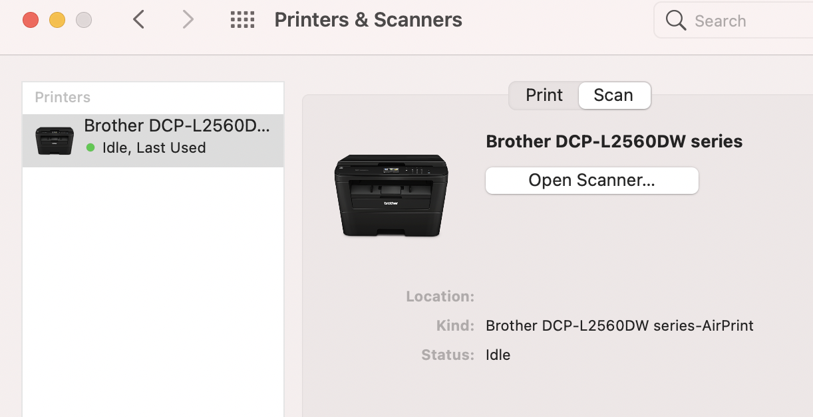

# Scanning

I have a printer from Brother and when I setup my new MBP the `Scan` tab was missing in the `Printers & Scanners` UI. Here is how I fixed it:

1. Download drivers for the scanner from the [Brothers site](https://support.brother.com/g/b/downloadtop.aspx?c=eu_ot&lang=en&prod=dcpl2560dw_eu)
1. Right-click in the empty part of the list of printers and chose `Reset printing system...`
1. Add the printer again, this time it will (hopefully) say `Bonjour multifunction`

This made the `Scan` tab appear again

