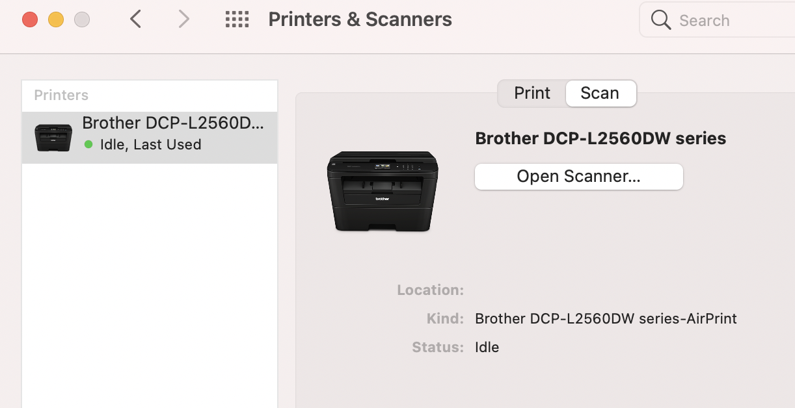

# Scanning

I have a printer from Brother and when I setup my new MBP the `Scan` tab was missing in the `Printers & Scanners` UI. Here is how I fixed it:

1. Download drivers for the scanner from the [Brothers site](https://support.brother.com/g/b/downloadtop.aspx?c=eu_ot&lang=en&prod=dcpl2560dw_eu)
1. Right-click in the empty part of the list of printers and chose `Reset printing system...`
1. Add the printer again, this time it will (hopefully) say `Bonjour multifunction`

This made the `Scan` tab appear again

## My printer has a Web Page!

2023-05-11: Once again I'm having trouble scanning. After updating macOS to v13.3.1 the UI for "Printers & Scanners" changed and clicking on "Open scanner" just gives me an empty dialog most of the time and a couple of times this error message has been shown:

> Failed to open a connection to the device (-21345)

While poking around I discovered that the printer hosts its own web page:

1. Click "Printer queue"
2. Click the little cog up to the right
3. Click "Show Printer Web Page..."

No web page was rendered but still..

2026-07-03: The same problem as in May 2023 appeared again. I could print but opening the scanner UI once again resulted in:

> Failed to open a connection to the device (-21345)

Claude suggested this action which resolved the issue:

> Check local network permission: System Settings → Privacy & Security → Local Network — make sure scanning apps are allowed (a Sequoia-era gotcha).

At the bottom of the list was `Brother Scanner.app` and after flipping "Allow applications below to find and communicate with devices..." the scanner UI connected to the scanner. Not clear why that permission suddenly had to be enabled.
