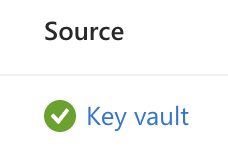

# KeyVault

KeyVault is probably a good place to keep secrets that your app needs to have access to but the REST api has some downsides:

- It can be slow (tens of ms)
- There's a rate limit for requests
- If you have a many of secrets you'll have to paginate when listing them
- You can only fetch one secret at a time (listing only returns the name of the secret)

I've been in a project where both secrets and regular config values were kept in KeyVault which triggered all these downsides. Cold starts were slow, we hit the rate limit when restarting the whole Kubernetes cluster and the code made lots of requests due to the last two points.

So in my experience, this is best practice when using KeyVault:

1. Keep secrets to a minimum
2. Don't fetch secrets at all from your code

How is the last point possible? It's only possible if you host your app in Azure, but if that's the case you can use [KeyVault references](https://learn.microsoft.com/en-us/azure/app-service/app-service-key-vault-references).

## Using KeyVault references in AppSettings

These are the basic steps:

1. In Azure, create a managed identity for your app
2. In KeyVault, grant the managed identity `Get` premission for `Secrets`
3. In your app, assign it the managed identity (`Identity/UserAssigned`)..
4. ..and also make it the `keyVaultReferenceIdentity` (needed because apps can have several managed identities)
5. In your app settings, reference KeyVault secrets using `@Microsoft.KeyVault(SecretUri=...)`

Under `Settings`/`Environment variables`/`App settings` you should see a green checkbox:



The big win here is that you don't need any KeyVault nuget or code in your projects. And hopefully Azure is managing the communication between your app and KeyVault in the best possible way (backoff strategy, caching(?) etc).

### Hands on

First create a managed identity for your app:

```bicep
resource myManagedId 'Microsoft.ManagedIdentity/userAssignedIdentities@2023-01-31' = {
  name: 'my-managed-id'
  location: 'WestEurope'
}
```

And then set your app to use it as `identity` and also set it as `properties.keyVaultReferenceIdentity`:

```bicep
resource arendeApi 'Microsoft.Web/sites@2023-01-01' = {
  name: 'my-app'
  location: location
  identity: {
    type: 'UserAssigned'
    userAssignedIdentities: {
      '${myMangedId.id}': {}
    }
  }
  properties: {
    keyVaultReferenceIdentity: myMangedId.id
  }
}
```

In KeyVault, grant the managed identity `get` permission for `secrets` (and then add your secret):

```bicep
resource keyVault 'Microsoft.KeyVault/vaults@2023-07-01' = {
  name: 'my-kv'
  location: location
  properties: {
    accessPolicies: [
      {
        tenantId: tenant().tenantId
        objectId: myManagedId.properties.pincipalId
        permissions: {
          keys: []
          secrets: [
            'get'
          ]
        }
      }
    ]
  }
}
```

In your app settings, reference the KeyVault secret like this:

```
'ThirdPartySecret': '@Microsoft.KeyVault(SecretUri=https://my-kv.vault.azure.net/secrets/ThirdPartySecret/)'
```
