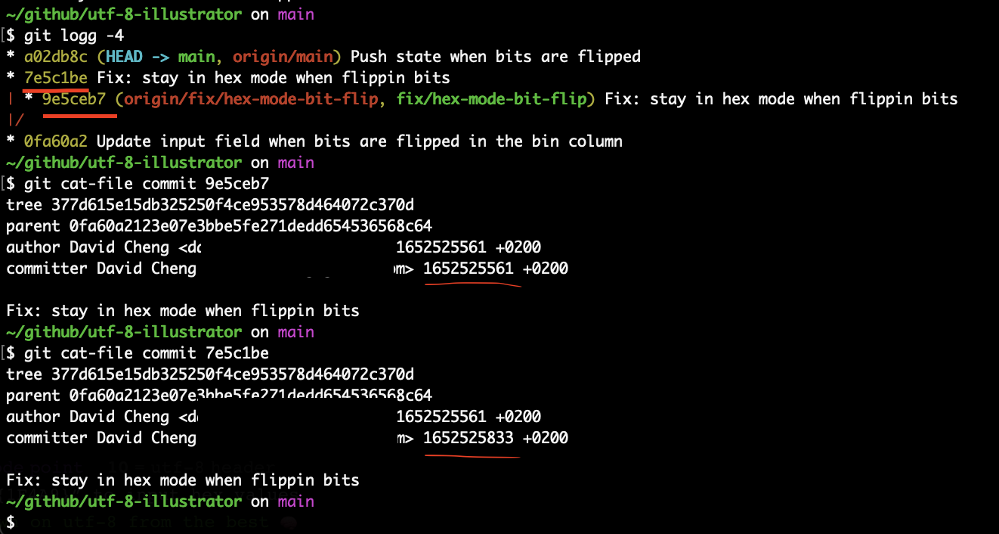

# Githubs Rebase Commit Mystery

## Background

I recently closed a PR on github using `Rebase and merge` and noticed that a new commit SHA was created on `main` instead of `main` just being fast-forwarded to the tip of my feature branch.

```
Before            After             Expected
  C [feature]     C' [main]         C [main] [feature]
  |               | C [feature]     |
 /                |/                |
B [main]          B                 B
|                 |                 |
A                 A                 A
```

## Why this was unexpected behavior for me

When you use `git rebase` in the terminal, or when you close a PR with `Rebase` i Azure DevOps, you get the fast-forward that doesn't create a new commit SHA.

Checking the [github documentation](https://docs.github.com/en/pull-requests/collaborating-with-pull-requests/incorporating-changes-from-a-pull-request/about-pull-request-merges#rebase-and-merge-your-pull-request-commits) confirmed that this was intentional behavior:

> The rebase and merge behavior on GitHub deviates slightly from git rebase. Rebase and merge on GitHub will always update the committer information and **create new commit SHAs**, whereas git rebase outside of GitHub does not change the committer information when the rebase happens on top of an ancestor commit

## Understanding exactly why a new SHA is created

Even though the documentation is kind enough to point out that this new SHA is achieved by updating/altering the committer information, I didn't immediately get exactly what that meant. Diffing the `git show` output of the two commits didn't show any differences apart from the commit SHA.

Turns out that there's a nifty command that lists everything that the SHA is calculated from: `git cat-file commit {SHA}`.

After running that command on the two commits I could see in plain text that the timestamp of the `committer` (as opposed to the `author` which is shown by default when using `git show`) had been altered by github.

