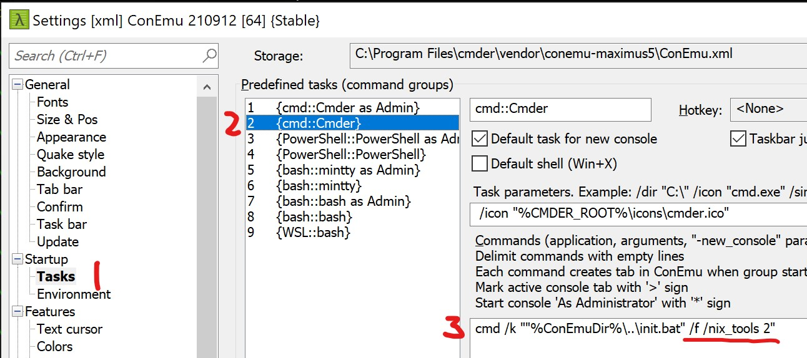

# Setup Cmder

## Avoid the `sort` imposter

One of the best things with `cmder` is that you get access to the nix tools that you are used to, such as `ls`, `cd` and `sort`. But windows has its own `sort`, that is less capable than the nix `sort`, and depending on the order of paths in `$PATH` you might be using the less capable windows version of `sort`.

Run `where sort` to see where both are located and if `C:\Windows\System32\sort.exe` is listed first then you're using the windows version.

### How to summon the nix `sort`

There is [a way to tell `cmder` to "prefer nix tools"](https://github.com/cmderdev/cmder/pull/1988) by adding `/nix_tools 2` to the task that creates a new shell. This argument makes `cmder` prepend `$PATH` with the path to the nix `sort` (in my case `C:\Program Files\Git\usr\bin\sort.exe`).

This did the trick on my previous windows laptop but on my current it didn't work. It looks like the cmder script first checks if the nix path is already in `$PATH` and if it is the script exits without prepending it. One solution could have been to simply edit `$PATH` so they appear in the desired order. But while reading the cmder scripts I noticed that there's a `/f` argument and when present the `$PATH` check is omitted. Since `/f` [enables "Fast Init Mode"](https://github.com/cmderdev/cmder#changing-cmder-default-cmdexe-shell-startup-behaviour-using-task-arguments), and creating a new tab can be a bit slow, I opted to solve my issue by adding that arg.

Press <kbd>Win</kbd> + <kbd>Alt</kbd> + <kbd>P</kbd> (or <kbd>Command</kbd> + <kbd>Option</kbd> + <kbd>P</kbd> on a Mac keyboard) to open settings:

## Nifty tips

Open a new tab: <kbd>Alt</kbd> + <kbd>Shift</kbd> + <kbd>2</kbd>. This will run task `2` in the screenshot above and create a `cmd` shell in a non admin mode.

Add aliases in `C:\Program Files\cmder\config\user_aliases.cmd`

## Colors

The default color scheme is nice but `xterm` is even better imo (`Settings` -> `Features` -> `Colors` -> `Schemes`).

