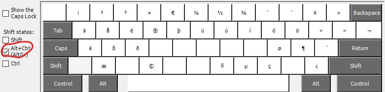

# Custom Keyboard Layout

## Why?

Keyboard layouts in windows have "dead keys" for some keys like <kbd>~</kbd> and <kbd>^</kbd>. When pressing a "dead key" windows waits for the next keypress before any glyph is rendered.

This isn't very practical if you're just trying to type `~` as in the nix shortcut for the home directory.

## How to fix it?

1. Download the [Keyboard Layout Creator](https://www.microsoft.com/en-us/download/details.aspx?id=102134)..
1. ..which depends on .NET Framework 3.5
1. Then watch [this youtube video](https://www.youtube.com/watch?v=87bt7GBM02M)

## My customized layout

Using `Keyboard Layout Creator` I edited the "US International" layout and removed dead keys.

